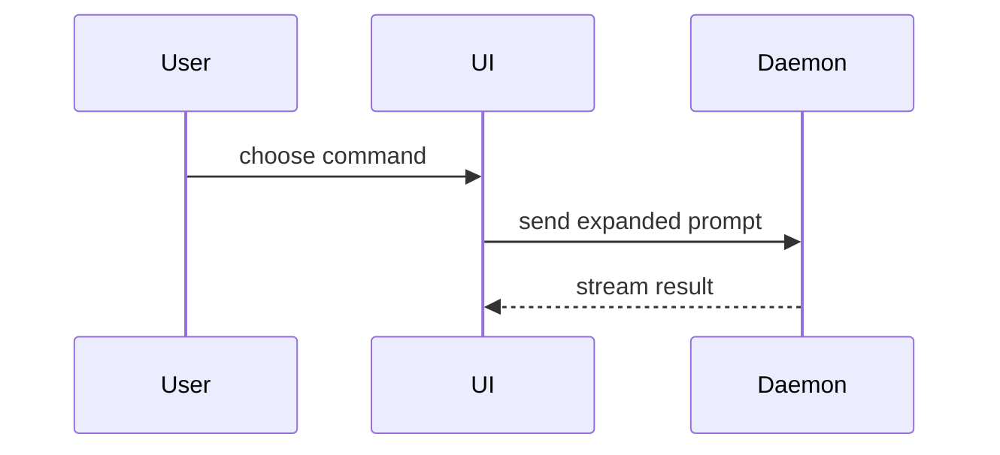

# 図の種類

概要に添える図の種類と例。

## 擬似コード

ロジックやアルゴリズムを示す。

```text
on(save)
  if content is unchanged
    return cached result
  write new content
  return fresh result
```

## コールツリー

実行時の制御フローを示す。

```text
submitForm
  createSession
    persistPrompt
    launchAgent
  navigateToSession
```

## コンポーネントツリー

UIの構造を示す。重要なstateやモジュールの境界も含める。

```text
<SessionPage> (apps/example/src/routes/session.tsx)
  useSessionEvents()
  <SessionToolbar>
    <RunSkillButton> (packages/ui)
```

## ファイルツリー

ファイルの責務や広範なリファクタリングを、浅いツリーで示す。

```text
src/
├── commands/       # ユーザー操作を解析する
├── sessions/       # セッションの状態を持つ
└── transport/      # APIリクエストを送る
```

## Mermaid

コンポーネント間のやり取り、制御フロー、データフローを示す。



## diff

周囲の形が既にあり、何が変わるかが要点のときに使う。diffの形は対象に合わせる。

### コンポーネントの変更

```diff
 <SessionPage>
   useSessionEvents()
   <SessionToolbar>
+    <RunSkillButton />
   <SessionTimeline>
+    <SkillResultCard />
```

### ファイル構成の変更

```diff
 src/
 ├── commands/
+│   └── show-me.ts       # スラッシュコマンドを展開する
 ├── sessions/
-└── transport.ts
+└── transport/
+    ├── client.ts
+    └── stream.ts
```

### コールツリーの変更

```diff
 submitForm
   createSession
     persistPrompt
+    expandSkillMention
     launchAgent
-  navigateToSession
+  navigateToSession
+    subscribeToEvents
```

### 状態や制御フローの変更

```diff
 on(save)
-  write content
+  if content is unchanged
+    return cached result
+  write new content
+  invalidate cache
```

## ブロック全体

大部分が新規のとき、省略すると所有関係や順序が分からなくなるとき、コピーできる完成形が必要なときに使う。

```ts
function expandSkill(command: string): string {
  const skillName = command.slice(1);
  return `use the ${skillName} skill`;
}
```
